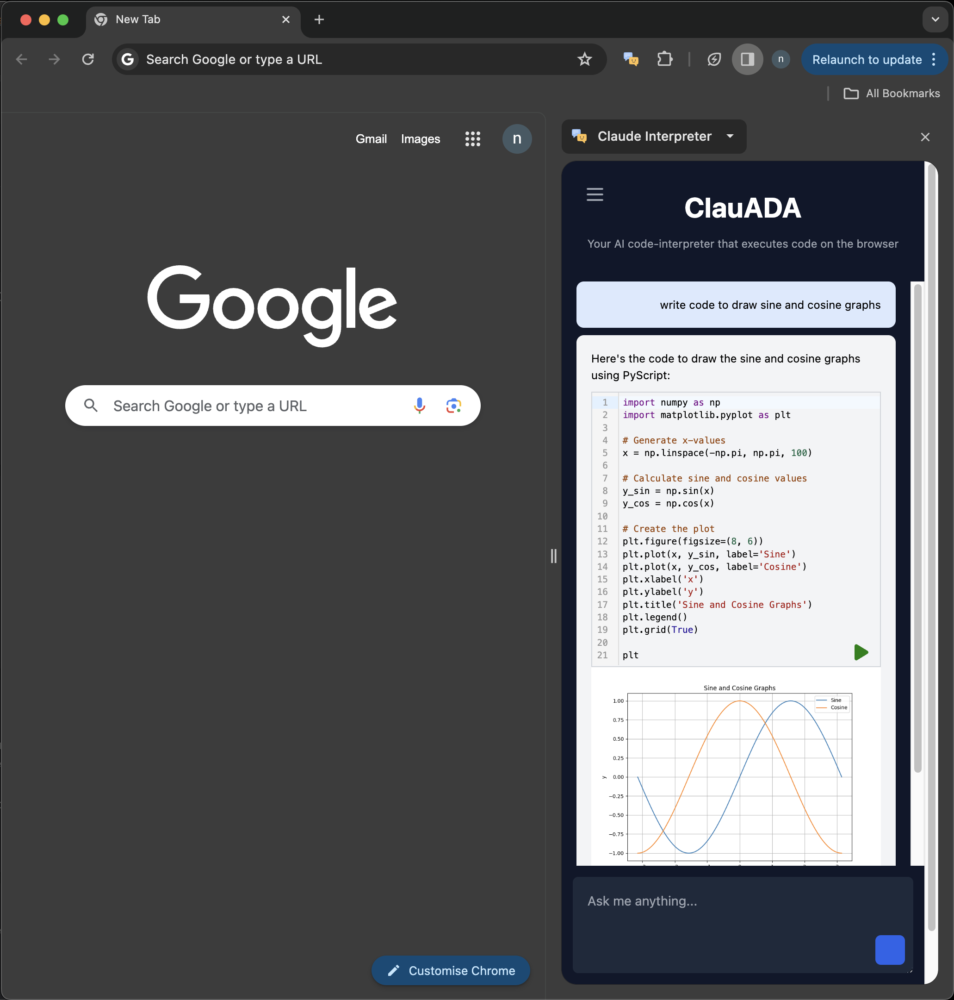

# clauADA

A chrome extension that enables Code-Interpreter/Advanced Data Analysis mode for Claude by executing Python code within the browser

It generates code for the given query using Claude APIs and uses PyScript, Pyodide and WASM to run full-fledged Python code including data analysis libraries like Pandas, Matplotlib, numpy, nltk etc.

The generated code is shown in an editable interface, so you can make any changes if required before running the code.

To quickly test the extension : 
- Download this repo as a zip and extract it or git clone
- Go to Chrome - Extensions - Manage Extensions
- Turn on developer mode
- Click load unpacked
- Select the dist folder
- Load the extension from the Extensions menu
- Click the hamburger button - Settings and set up API keys for either Anthropic API or AWS Bedrock (note that the Bedrock ID should have [access to Claude models](https://docs.aws.amazon.com/bedrock/latest/userguide/model-access.html))
- You are ready to chat and run python code on the browser
- Please note that the extension is tested only on Chrome and might not work on other browsers.

